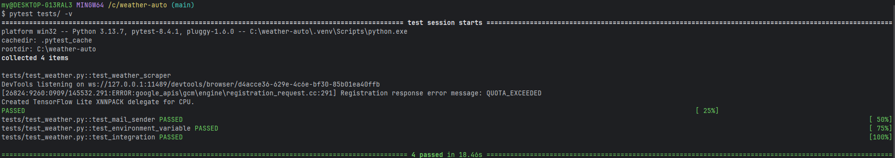
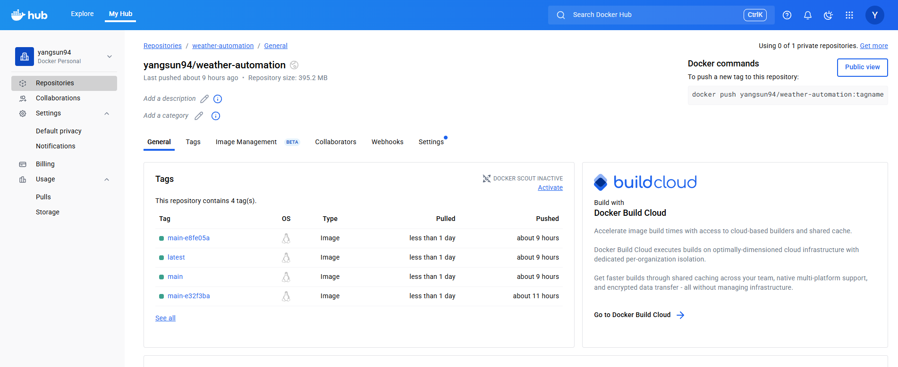
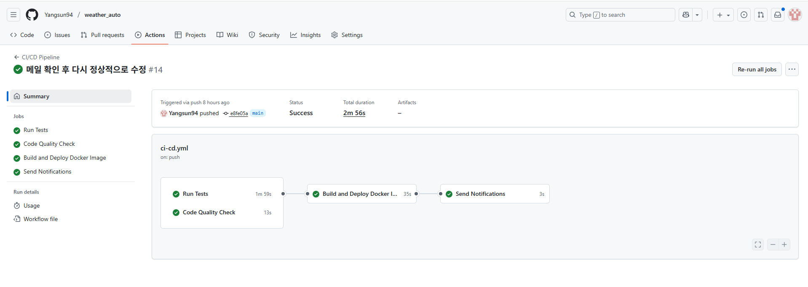
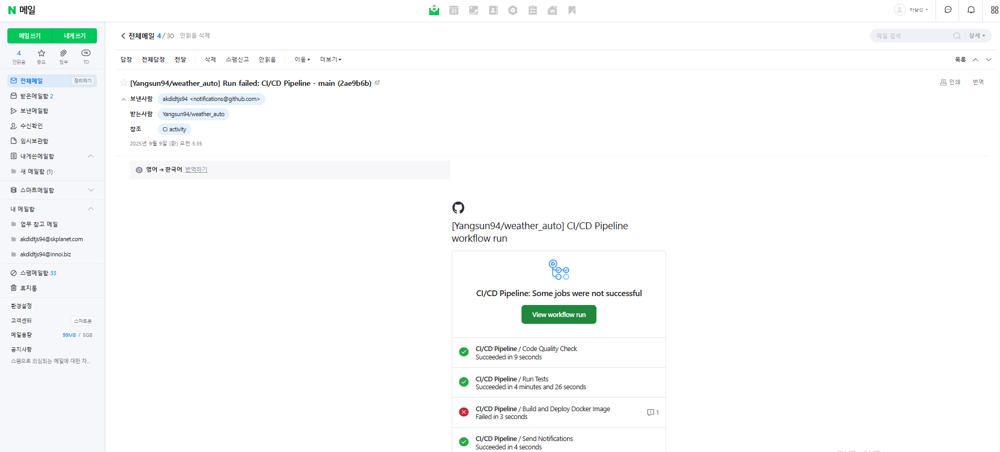
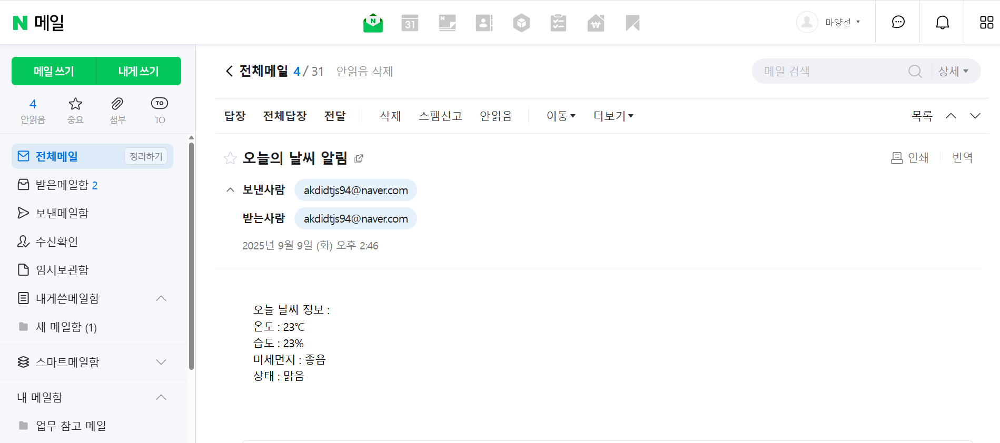

[](https://github.com/Yangsun94/weather_auto/actions)
[](https://python.org)

# 🌤️ 날씨 이메일 자동화

매일 아침 오늘의 날씨 정보를 이메일로 자동 발송해주는 Python 프로그램입니다.

## ✨ 주요 기능

🌡️ 실시간 날씨 데이터 수집: Selenium을 이용한 기상청 웹사이트 스크래핑
📧 자동 이메일 발송: 네이버 SMTP를 통한 날씨 정보 이메일 전송
🐳 Docker 컨테이너화: 환경 독립적 실행 및 배포
🔄 CI/CD 파이프라인: GitHub Actions를 통한 자동화된 테스트/빌드/배포
🧪 포괄적 테스트: 단위 테스트, 통합 테스트, Mock 테스트 포함
📊 코드 품질 관리: Black, isort, flake8를 통한 자동화된 코드 품질 검사
🚨 실패 알림 시스템: CI/CD 실패시 자동 이메일 알림

## 🛠️ 기술 스택

- **Python 3.10+**: 메인 언어
- **Selenium**: 웹 스크래핑
- **SMTP**: 이메일 발송 (네이버)
- **pytest**: 테스트 프레임워크
- **Docker**: 컨테이너화
- **GitHub Actions**: CI/CD

## 📋 요구사항

- Python 3.10+
- Chrome 브라우저 (headless 모드로 실행)
- 네이버 이메일 계정

## 🚀 빠른 시작

### 1. 프로젝트 클론
```bash
git clone https://github.com/Yangsun94/weather_auto.git
cd weather-automation
```

### 2. 가상환경 생성 및 활성화
```bash
python -m venv venv
source venv/bin/activate  # Windows: venv\Scripts\activate
```

### 3. 패키지 설치
```bash
pip install -r requirements.txt
```

### 4. 환경변수 설정
`.env` 파일을 생성하고 다음 내용을 입력하세요:
```env
EMAIL_USER=your_email@naver.com
EMAIL_PASS=your_app_password
EMAIL_RECEIVER=recipient@example.com
```

> 💡 **네이버 앱 비밀번호 설정 방법**: 네이버 → 내정보 → 보안설정 → 2단계 인증 → 앱 비밀번호 생성

### 5. 실행
```bash
python main.py
```

## 📁 프로젝트 구조

```
weather-automation/
├── main.py                     # 메인 실행 파일
├── src/
│   ├── __init__.py
│   ├── weather_scraper.py      # 날씨 정보 스크래핑
│   └── mail_sender.py          # 이메일 발송
├── tests/
│   └── test_weather.py     # 통합 테스트
├── .github/
│   └── workflows/
│       └── ci-cd.yml           # GitHub Actions 워크플로우
├── .env.example               # 환경변수 템플릿
├── requirements.txt            # Python 패키지 목록
├── .env                        # 환경변수 (직접 생성 필요)
├── .gitignore
├── Dockerfile                  # Docker 환경 설정
├── .dockerignore
└── README.md
```

## 🧪 테스트 실행

*모든 테스트 통과 확인 (4개 테스트, 18.46초 소요)*


```bash
# 전체 테스트 실행
pytest tests/ -v

# 특정 테스트만 실행
pytest tests/test_weather.py
```

## 🐳 Docker 실행

*CI/CD 파이프라인을 통해 자동 배포된 Docker 이미지들*


```bash
# Docker 이미지 빌드
docker build -t weather-automation .

# Docker 컨테이너 실행
docker run --env-file .env weather-automation
```

## 🔄 CI/CD 파이프라인

*GitHub Actions 파이프라인 성공 실행 화면*


*GitHub Actions 파이프라인 실패 메일발송*


자동화된 워크플로우

코드 푸시 → GitHub 저장소
자동 트리거 → GitHub Actions 실행
병렬 처리: 자동 테스트 실행 + 코드 품질 검사 (Black, isort, flake8)
성공시 → Docker 이미지 빌드 및 Docker Hub 배포
실패시 → 자동 이메일 알림 발송

## 📧 이메일 예시

*실제 받은 날씨 정보 이메일*


받게 될 이메일 내용:
```
제목: 오늘의 날씨 알림

오늘 날씨 정보 : 
온도 : 23℃
습도 : 65%
미세먼지 : 좋음
상태 : 맑음
```

## 🔧 문제 해결

### ChromeDriver 환경별 호환성 문제

문제: 로컬(Windows/Mac)과 CI 환경(Linux)에서 ChromeDriver 버전 충돌

### 문제 상황
service = Service(ChromeDriverManager().install())  # 모든 환경에서 동일하게 사용

### 해결책
        # Docker 환경: 시스템 ChromeDriver 사용
    if os.path.exists('/usr/local/bin/chromedriver'):
        service = Service('/usr/local/bin/chromedriver')
    else:
        # 로컬 환경: ChromeDriverManager 사용
        service = Service(ChromeDriverManager().install())

### CI/CD 코드 품질 검사 실패
문제: Black, isort 포맷팅 기준 불일치로 파이프라인 실패

### 문제 상황
    # 에러 메시지
    4 files would be reformatted, 2 files would be left unchanged.
    Error: Process completed with exit code 1.

### 해결책
로컬에서 사전 포맷팅 적용

    # 해결 과정
    black .
    isort .
    git add .
    git commit -m "코드 포맷팅 적용"

프로젝트 링크: https://github.com/Yangsun94/weather_auto.git

Docker Hub: https://hub.docker.com/repository/docker/yangsun94/weather-automation

---